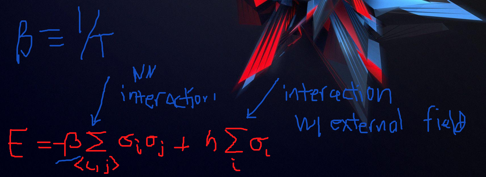
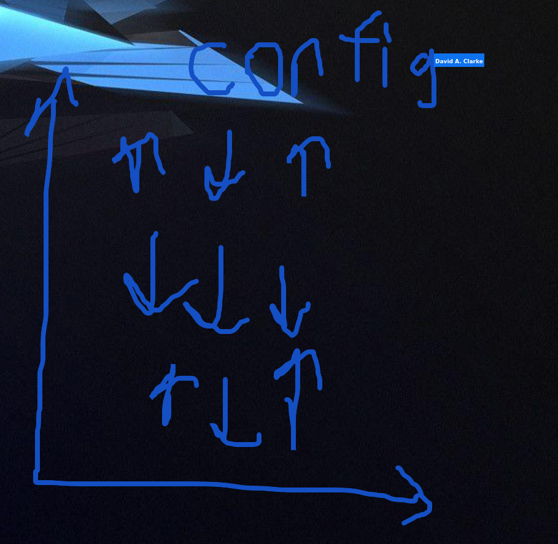

- If all the spins are going one way then there's a magnetic field in one direction.
- 2D is nice because it can be solved by hand but 3D can't be solved by hand
- Montecarlo methods
- In physics we always like to discriminate between macroscopic models and microscopic models. We're looking at a microscopic model in the picture. Macroscopic would be the field or temperatuere. Microscopic spins like to align with their neighbors. 
- If I want to know the energy of the system.
- There are multiple configurations that can have this configuration. Monte carlo is helpful because we can generate things that have the same macroscopic class.
- An interesting thing that happens with magnents. One way I could destroy the magnet is just heating it up. I told you the spins prefer to be aligned. If I dump enough heat into the system than these spins can fluxuate up and down. If there's enough heat than the power of neighboring interactions is weak enough that I can neglect it.
- If I bring a magnet like this to a high enough temperature than we get random configurations. At that point we lose our magnetic field because we have as many pointing up as are pointing down
- What's interesting is that if I start with a very hot magnet, one that's scrambled up, then after that I take another with a really powerful external field, that's pointing up, then I lower the temperature, then I can retrain the magnet
- Now you can ask a more interesting thing, I have my hot magnet, and I start lowering the temperature, what happens? At below a certain critical temperature, you don't have the energy to kick these guys pointing in random directions, they'll start to coaelese 

- Red is pointing up and blue is pointing down. What they're doing is lowering the the temperature and they come together. In really extreme situations you can get all of it to be red or all of it to be blue.

- The hardest places to flip these are along these borders called domain borders. If you go far enough than they should all come togethre. This is called a phase transition.
- We had one phase where they're all pointing different directions.
- We have another phase where they all line one way or another.
- There's no way to figure out which way it is going to go, whether it is going to go up or down, it's effectively random.
- You started with a system that didn't know about up or down and then we forced it. That's called breaking the symmetry.
- bdhammel.com/ising-model

- In this system the magnetization is about zero. We could flip all the spins here and change any measurable physics (the magnetic field)
- Whereas in the case that all the spins are pointing up or pointing down than my magnetization goes from +1 to minus 1 and this happens sort of randomly by lowering the temperature
- We understand this well, we can classify what state it is, in the same way that we do with water. It has an ordered phase or disorderd phase. If the magnetization is not 0 it is in one phase, otherwise it is another phase.
- The amount of the magnetization is called the order paramater. In general, an order parameter is some macroscopic parameter that tells us what phase you're in.
- A few ways we make 2D more complicated
  - 2D model make 3d
  - Only allow the spins to be up or down, but realistically they can rotate along a sphere. If you allow a spin to spin along a sphere. It's a heisenberg model.

- STudent simulates at a bunch of different temperatures, in high temperatures the magnetization is zero and at the low temperatures it is not zero.
- We're starting with the heisenberg model, we like to start with things that we can compute in a non machine learning way. In this case we can look at the order parameter and we can look at what phase it's in.
- Another strategy is to just look at the spins.
- He used bits 1 for red 0 for blue.
- It must be read in with bits. Instead of being an up down bit. In the ising model, in the heisenberg model, every box is two angles. It's too real numbers. They represent the longitutde and latitude of the little sphere that's there. What we're working up to is a system where instead of lying on a sphere, it is on a hypersphere, if I wrap around the sphere once the sign changes. That weird sphere gets represented by 18 numbers. 
- The number of boxes is usually really big, like 40,0000 boxes. It's very expensive, there's thousands of these lattices.
- The challenge is the following, we want the machine learning algorithm to look at the binary and guess what phase it is in:

- The problem is that for the one we're interested in has no order parameter.
- We want to target the QCD transition, when protons and neutrons melt. We want to know when they turn into quarks and gluons. There's no phase transition.
- We want to start with heisenberg
- We have the pure S3 model, it's the double hypersphere thing. If I don't have any quarks at all than it does have a phase transition called the deconfinement transition.
- The polyokov loop is a representation of an infinitely heavy quark. It's the order parameter. We can use it just like the magnetization. We can find out if the system is confined or deconfined.grant@taikon

 As T (temperature) goes to infinity the whole thing goes to zero which reflects the fact that as the temperature increases the magnetization goes to zero

- Once a configuration has been generated

- We'll call this configuration zero. We can measure the energy on this configuration and I measure it according to the above rule. I multiply all nearest neighbors (and then do some other math). The result of that will be the first element ofthe energy array.
- 
## Outputs

Using the state, is it ordered or disordered. It will look at the magnetization.

- Temperature
- State (collection of all the up downs 10x10)
- Magnitization
  - If magnetization is above a certain threshold we say it is ordered otherwise not

If below threshold disordered, if higher than threshold ordered

## 18 Numbers

Things we use to determine

- Kairal Condenscate
- Different masses
- Abstract quantities
- We have regions that are unambiguously confined